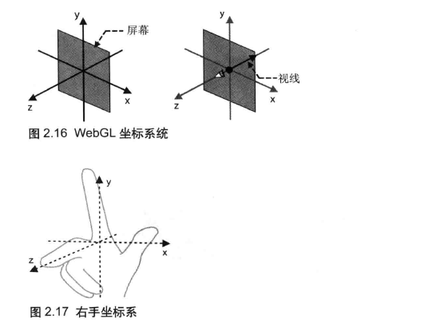
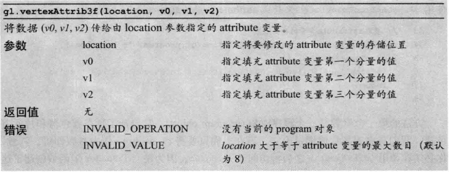
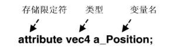
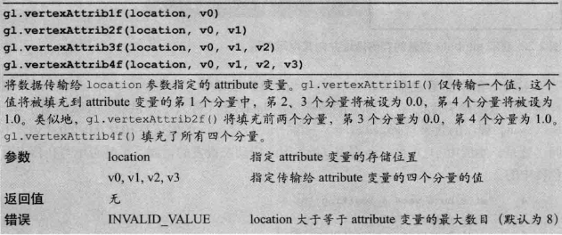
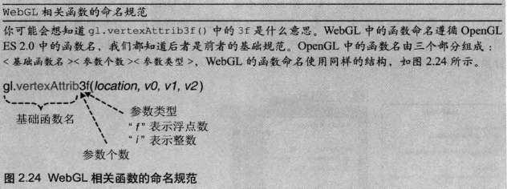
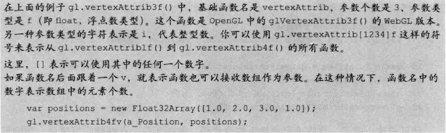
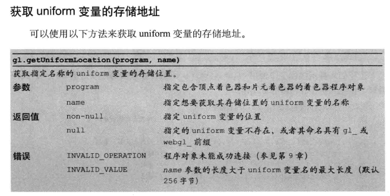
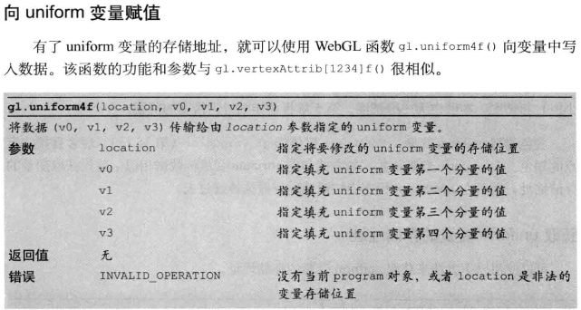

##Chapter02
###`HelloCanvas`   
WebGL将使用的<canvas>绘制图形
```
<canvas id="webgl" width="400" height="400">
    Please use the browser supporting "canvas"
</canvas>
```   
在body里引入一些专为WebGL准备的，事先定义好的函数库，这些库需要手动下载到本地   
```
<script src="../../lib/webgl-utils.js"></script>
<script src="../../lib/webgl-debug.js"></script>
<script src="../../lib/cuon-utils.js"></script>
```
JavaScript文件，在<canvas>中绘制图形   
```
<script src="HelloCanvas.js"></script>
```
在js中只有一个main()函数，将这个函数绑定到HelloCanvas.html中`<body>`元素的onload属性上   
接下来是main()函数的执行流程，包含四个步骤。   

```
function main() {
    //获取<canvas>元素
    var canvas = document.getElementById('webgl');

    //获取WebGL绘图上下文
    var gl = getWebGLContext(canvas);
    if(!gl){
        console.log('Failed to get the rendering context for WebGL');
        return;

    }
    //指定清空<canvas>的颜色
    gl.clearColor(0.0,0.0,1.0,1.0);

    //清空<canvas>
    gl.clear(gl.COLOR_BUFFER_BIT);//这里gl.COLOR_BUFFER_BIT是清空颜色缓冲区
}
```
   

   
###`HelloPoint1`
WebGL依赖于一种称为着色器(shader)的绘图机制，要使用WebGL进行绘图必须
要使用着色器。在代码中，着色器程序是以字符串的形式“嵌入”在JavaScript文
件中的，在程序真正开始运行前就已经设置好了。  
**WebGL**需要两种着色器    
- 顶点着色器（Vertex shader）：顶点着色器是用来描述顶点特性（如位置、颜色等）
的程序。顶点（Vertex）是指二维或三维空间中的一个点，比如二维或三维图形的端点或交点。   
- 片元着色器（Fragment shader）：进行逐片元处理过程如光照的程序。片元（Fragment）
是一个WebGL术语，可以将其理解为像素。   
    
颜色缓冲区的额的内容会自动显示在浏览器中，下图为简化版 
 
着色器使用类似于C的OpenGL ES着色器语言来编写，着色器程序代码必须预先处理成单个字符串的形式，所以
我们用＋号连接，每一行以\n结束，这样做有助于检查代码。    
以下为着色器程序代码  
```
var VSHADER_SOURCE =
    'void main() {\n' +
    ' gl_Position = vec4(0.5,0.5,0.0,1.0);\n' +//设置坐标
    'gl_PointSize = 10.0;\n' +//设置尺寸（像素）
    '}\n';

//片元着色器
var FSHADER_SOURCE =
    'void main(){\n' +
    ' gl_FragColor = vec4(1.0,0.0,0.0,1.0);\n' +//设置颜色
    '}\n'
``` 
顶点着色器程序和C语言一样，必须包含交一个main()函数，void表示没有返回值，且不能为main指定参数
 
注意，gl_Position变量必须赋值，gl_PointSize不是必须的，如果不赋值，默认为1.0。    
GLSL ES是一种强类型的编程语言，需要为变量指定类型，以下为几种数据类型  
   
这里gl_PointSize为浮点类型，所以必须赋值为浮点数，否则会报错    
另一个变量gl_Position类型为vec4；vec4是由3个浮点数组成的矢量。
由于传入的参数我们这里只有XYZ坐标的值，所以我们添加1.0作为第四个分量。称为齐次坐标。   
   
片元着色器将点的颜色赋值给gl_FragColor变量，该变量是片元著色器唯一的内置变量，它控制
像素在屏幕上的最终颜色  
     
       
   
以下为initShaders方法的参数 
    
在初始化著色器之前，顶点着色器和片元着色器都是空白的，我们需要将字符串形式的着色器代码从
JavaScript传给WebGL系统，并建立着色器，这就是ininShaders()所做的事情。注意，着色器
运行在WebGL系统中，而不是JavaScript程序中。   
目前最重要的是，WebGL程序包括运行在浏览器中的JavaScript和运行在WebGL系统的着色器程序这两个部分   
 绘制操作
 
     
      
 下面为完整代码    
 ```
 var VSHADER_SOURCE =
     'void main() {\n' +
     ' gl_Position = vec4(0.5,0.5,0.0,1.0);\n' +//设置坐标
     'gl_PointSize = 10.0;\n' +//设置尺寸（像素）
     '}\n';
 
 //片元着色器
 var FSHADER_SOURCE =
     'void main(){\n' +
     ' gl_FragColor = vec4(1.0,0.0,0.0,1.0);\n' +//设置颜色
     '}\n'
 
 //WebGL程序包括运行在浏览器中的JavaScript和运行在WebGL系统的着色器程序这两个部分
 function main() {
     //获取<canvas>元素
     var canvas = document.getElementById('webgl');
 
     //获取WebGL绘图上下文
     var gl =getWebGLContext(canvas);
     if(!gl){
         console.log('Failed to get the rendering context for webGL');
         return;
     }
 
     //初始化着色器
     if(!initShaders(gl,VSHADER_SOURCE,FSHADER_SOURCE)){
         console.log('Failed to initialize shaders.');
         return;
     }
     //设置<canvas>背景色
     gl.clearColor(0.0,0.0,0.0,1.0);
 
     //清空<canvas>
     gl.clear(gl.COLOR_BUFFER_BIT);
 
     //绘制一个点
     gl.drawArrays(gl.POINTS,0,1);
 }
 ``` 
 **WebGL坐标系统**  
   
 ###`HelloPoint2` 
 现在我们要做的是将位置信息从JavaScript程序中传给顶点着色器。有两种方式可以做到这一点：
 **attribute变量和uniform变量**，attribute变量用来传输与顶点相关的数据，而uniform
 变量用来传输与顶点无关的，本例使用attribute变量来传输顶点坐标，显然不同的顶点
 通常具有不同的坐标。 
 使用attribute变量，需要包含以下几个步骤：  
 1. 在顶点着色器中，声明attribute变量；
 2. 将attribute变量赋值给gl_Position变量；
 3. 向attribute变量传输数据。   
 ```
 var VSHADER_SOURCE =
     'attribute vec4 a_Position;\n' +
     'attribute float a_PointSize;\n' +
     'void main() {\n' +
     ' gl_Position = a_Position;\n' +//设置坐标
     'gl_PointSize = a_PointSize;\n' +//设置尺寸（像素）
     '}\n';
``` 
```
 //获取attribute变量的存储位置
    var a_Position = gl.getAttribLocation(gl.program,'a_Position');
```

```
//将顶点位置传输给attribute变量
    gl.vertexAttrib3f(a_Position,0.5,0.5,0.0);
```
  
attribute 变量的声明必须按照以下的格式：<存储限定符><类型><变量名>   
   
gl.vertexAttrib3f()的同族函数
  
也可以使用这些方法的矢量版本，它们的名字以“v”结尾，并接受类型化数组作为参数，函数中的
数字表示数组中的元素个数。例如 
```
var position = new Float32Array([1.0,2.0,3.0,1.0]);
gl.vertexAttrib4fv(a_Position,position);
```

    
###`ClickedPoint`   
>注册事件响应函数
   
事件响应函数能异步地响应用户在网页上的操作，如点击鼠标等。   
下面是部分代码  
```

    //注册鼠标点击事件响应函数
    canvas.onmousedown = function (ev) { click(ev,gl,canvas,a_Position);
    };
    //将顶点位置传输给attribute变量
    gl.vertexAttrib3f(a_Position,0.0,0.0,0.0);
    gl.vertexAttrib1f(a_PointSize,10.0);
    //设置<canvas>背景色
    gl.clearColor(0.0,0.0,0.0,1.0);

    //清空<canvas>
    gl.clear(gl.COLOR_BUFFER_BIT);

    var g_points = [];//鼠标点击位置数组
    function click(ev,gl,canvas,a_Position) {
        var x =ev.clientX;//鼠标点击处的x坐标
        var y = ev.clientY;//鼠标点击处的y坐标
        var rect = ev.target.getBoundingClientRect();
        x =((x - rect.left)-canvas.height/2)/(canvas.height/2);
        y =(canvas.width/2 - (y - rect.top))/(canvas.width/2);
        //将坐标存储到g_points数组中
        g_points.push(x);g_points.push(y);

        //清空<canvas>
        gl.clear(gl.COLOR_BUFFER_BIT);

        var len=g_points.length;
        for(var i =0;i<len;i+=2){
            //将点的位置传递到变量中a_Position
            gl.vertexAttrib3f(a_Position,g_points[i],g_points[i+1],0.0);

            //绘制一个点
            gl.drawArrays(gl.POINTS,0,1);
        }
    }


}
```
###`ColoredPoints`  
用uniform变量将颜色值传给着色器 
1. 在片元着色器中准备uniform变量
2. 用这个uniform变量向gl_FragColor赋值
3. 将颜色数据从JavaScript传给该uniform变量  
  

   
下面是部分代码 
```
function click(ev,gl,canvas,a_Position,u_FragColor) {
        var x =ev.clientX;//鼠标点击处的x坐标
        var y = ev.clientY;//鼠标点击处的y坐标
        var rect = ev.target.getBoundingClientRect();
        x =((x - rect.left)-canvas.height/2)/(canvas.height/2);
        y =(canvas.width/2 - (y - rect.top))/(canvas.width/2);
        //将坐标存储到g_points数组中
        g_points.push([x,y]);
        //将点的颜色存储到g_colors数组中
        if(x>=0.0&&y>=0.0){    //第一象限
            g_colors.push([1.0,0.0,0.0,1.0]);//红色
        }else if(x<0.0&&y<0.0){ //第三象限
            g_colors.push([0.0,1.0,0.0,1.0]);//绿色
        }else{
            g_colors.push([1.0,1.0,1.0,1.0]);
        }
        //清空<canvas>
        gl.clear(gl.COLOR_BUFFER_BIT);

        var len=g_points.length;
        for(var i =0;i<len;i++){
            var xy = g_points[i];
            var rgba = g_colors[i];
            //将点的颜色传输到a_FragColor变量中
            gl.uniform4f(u_FragColor,rgba[0],rgba[1],rgba[2],rgba[3]);
            //将点的位置传递到变量中a_Position
            gl.vertexAttrib3f(a_Position,xy[0],xy[1],0.0);

            //绘制一个点
            gl.drawArrays(gl.POINTS,0,1);
        }
    }
```

   
   

   
   

